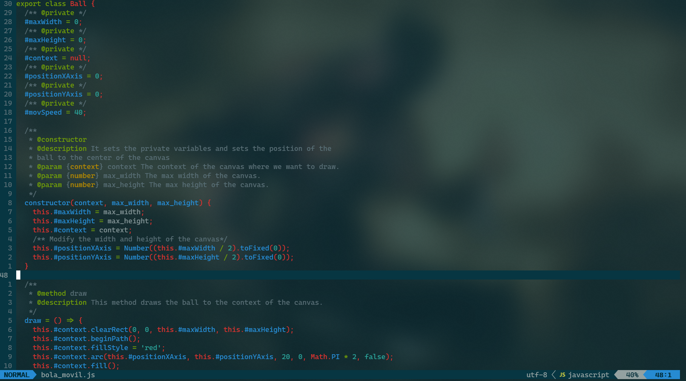
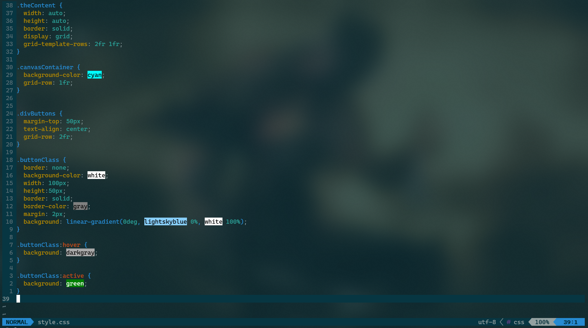
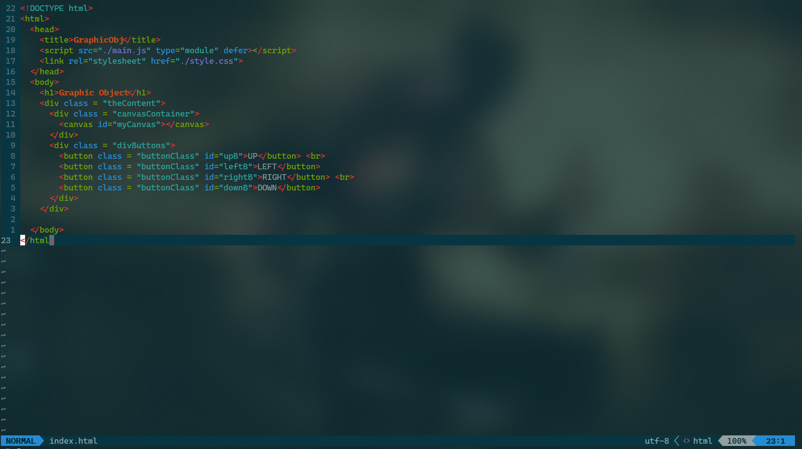
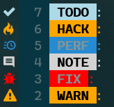
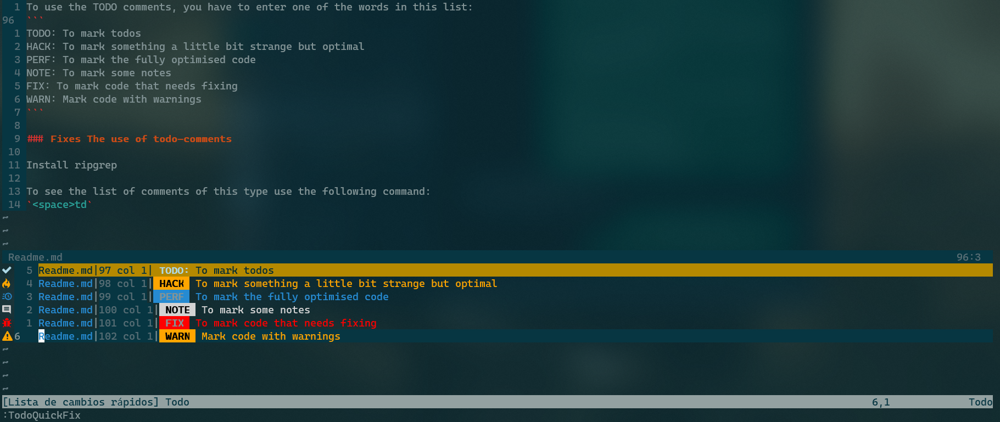

# Nvim configuration
**Author:** Lucas Hernández Abreu

**Email:** alu0101317496@ull.edu.es

If you have some issue, don't hesitate to contact me or open a github issue in this repo with your problem, I will try 
to answer with the solution as fast as possible.

----

# Preview
### JS Support Highlight

### CSS Support Highlight and color helper

### HTML Support Highlight


All the highlight comes from the use of TreeSitter for Nvim

# Installation

First of all we need to install nvim. For all this plugins to work we need a 0.6 or higher version of Nvim.

In Windows we can go to
[this page](https://github.com/neovim/neovim/wiki/Installing-Neovim) and follow the instructions for installation in Windows.

In Linux we have to use the following commands:
```bash
sudo add-apt-repository ppa:neovim-ppa/unstable
sudo apt-get update
sudo apt-get install neovim
```
In Mac we use:
```bash
brew install neovim
```

## Configuring the configuration

In linux go to `$HOME/.config/` and clone this repo there. Then change its name to `nvim`.

Open the editor with `nvim` and then use `:PlugInstall`.
If you see errors make sure the Python3/Python2 support and the Node support is enabled. To see this, enter `:checkhealth`.

In the `init.vim` file you will see this lines:

```vim
if has("unix")
  let g:python3_host_prog = "/usr/bin/python3"
else
  let g:python3_host_prog = "C:/Python310/python.exe"
endif
```

This lines tell nvim where is the python executable located.

# Plugins
All the plugins are installed with the `Plug` vim plugin manager. To add or delete plugins
go to the `plug.vim` and delete or add lines.
## DEFX
*Search for files or create files*
<br>
To initiate the file explorer press:
```vim
<Space> + nt
```
### Options
**Open file**
"\<CR\>", "l" or "o"

**New file**
Press "N" and write the name

**Navigate:**
- "k": up
- "j": down
- "l": open the file
- "h": go back -> `cd ..`


## TreeSitter

This is the fundamental part of this project, it solves the lack of highlighting in vim and nvim with the 
contribution of a open community that is developing all the support for different languages.

To know which highlighting have you installed use: `:TSInstallInfo`

To install some language support use: `:TSInstall <name_of_language>`

You can see the name of the language in the `TSInstallInfo` command.

### Fixes the JSDOC in treesitter parser

Go to the folder with the data of nvim and enter `nvim-treesitter/queries/ecma/indents.scm`

At the end of the file change the following line to:
```scm
  [
    (comment) @auto 
    (template_string)
  ] @ignore
```

Now the problem will be temporally fixed.

## TODO comments


To use the TODO comments, you have to enter one of the words in this list:
```
TODO: To mark todos
HACK: To mark something a little bit strange but optimal
PERF: To mark the fully optimised code
NOTE: To mark some notes
FIX: To mark code that needs fixing
WARN: Mark code with warnings
```

### Fixes The use of todo-comments

Install ripgrep

To see the list of comments of this type use the following command:
`<space>td`


## Markdown Preview

The markdown preview will open a server locally to watch the changes in your Markdown file while you are coding it.

To open the Markdown preview follow this instructions:
1. Enter the `.md` file
2. Write `:MarkdownPreview`
3. Enjoy the writting of markdown files.

